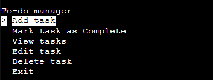
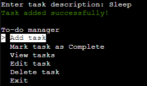
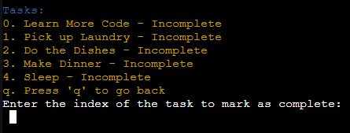
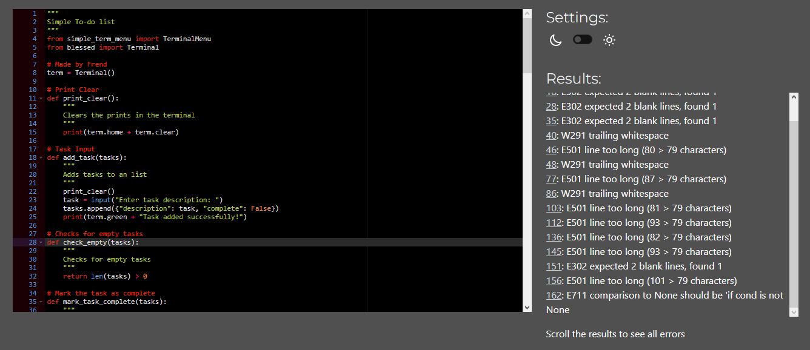

# To-Do List
[Simple Todo](https://simple-todo-34e0e06a5416.herokuapp.com) is a python terminal application that allows the user to add tasks that need solving to a index and call on them when they need a refresher.

---

### How to use    

1. Open this [link](https://simple-todo-34e0e06a5416.herokuapp.com) or copy it from here: `https://simple-todo-34e0e06a5416.herokuapp.com`, paste it into your browser's address bar, and press enter.
2. When the page is loaded, click the "RUN PROGRAM" button.
3. Add tasks using the keyboard to input tasks and navigate the menu using the arrow keys.

---

### Features
- ##### Main menu.
Under the welcome message, the user can see the main menu and can take immediate action by inputing the corresponding number, allowing them to easily set up the list of tasks that need to be done.

- ##### Adding tasks.
This feature lets you add tasks, and it is now colorized to improve accessability.

- ##### Mark Tasks as Complete
In this menu you can view the tasks that have been should be marked as complete, and inputing the corresponding number to mark it as complete.

- ##### Delete and Edit tasks
Mostly the same for the two other menues too, color was added to increase accessibility.

---

### Technologies used

###### Languages

- [Python](https://www.python.org/): The main language used to develop the script.
- [JavaScript](https://www.javascript.com/): The language used by the Code Institute to run the mock terminal in the browser.
- [HTML](https://www.w3schools.com/html/): The language used by the Code Institute to create the layout needed to run the mock terminal in the browser.

###### Other tools
- [GitHub](https://github.com/): used to host the application source code.
- [Codeanywhere](https://codeanywhere.com): used to edit the application source code.
- [Chrome](https://www.google.com/chrome/): used to run the application in the browser.

---

### Testing
The application was tested manually during the whole development process. All testing occurred in the IDE that Codeanywhere provides.

- There was a few application breaking bugs inside of my prior code, to fix the issues I looked up a simple menu package and started using that.

###### Validator results

[Python Checker](https://pep8ci.herokuapp.com/#) was used to check the code for meeting PEP8 requirements. There are minor warnings being shown, but the code runs fine. The results of the validator are in the screenshots below.

- `run.py`:

---

### Deployment

#### Heroku deployment

**The steps to deploy the application to Heroku are:**

1. Create a Heroku account if you don't have one.

2. In the dashboard, go to the "Apps" tab.

3. Click on the "New" button and choose "Create a new app".

4. Enter a name for the app.

5. Choose a region.

6. Click on the "Create" button.

7. Open the app you created and go to the "Settings" tab.

8. At the "Config Vars" section, click on the "Add" button and enter the following:

    - key: `PORT`
    - value: `8000`

9. At the "Buildpacks" section, click on the "Add" button and choose:

    - Python
    - Node.js
    The order of the buildpacks is important.

10. After that, click on the "Deploy" tab.

11. At the "Deployment method" section, choose GitHub and connect your GitHub account.

12. Then, you need to choose the repository you want to deploy.

13. Go down to the "Manual deploy" section, choose the branch you want to deploy, and click on the "Deploy branch" button.

14. The application will be deployed to Heroku. You can access it by clicking on the "View" button.

---

### Credits

- Sticky notes for giving me the inspiration to make an To-Do list in Python

- The template for running the application in the mock terminal in the browser was provided by [Code Institute](https://www.codeinstitute.net/).